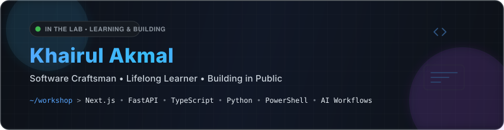

  

 

---

### 👋 About Me

I am a **Full-Stack Developer & Enterprise Automation Specialist** passionate about engineering resilient web applications, industrial operational portals, and automated workflow pipelines.

My work bridges modern full-stack web ecosystems (**Next.js**, **FastAPI**, **TypeScript**, **Tailwind CSS**) with mission-critical enterprise systems (**PowerShell**, **Power Automate**, **Microsoft 365**, **PostgreSQL / SQLite**). I focus on high reliability, offline resilience, and intuitive user experiences.

- 🚀 **Full-Stack Architecture:** Next.js (App Router), React 19, TypeScript, FastAPI, and modular REST APIs.
- 🏭 **Enterprise & Industrial Systems:** Purpose-built portals for testing operations, safety asset management, calibration tracking, and compliance.
- ⚙️ **Process & Systems Automation:** Automated data pipelines, PowerShell tooling, M365 integrations, and cloud flow synchronizers.
- 🤖 **Developer Tooling & AI Workflows:** Local agent harnesses, context indexing, and memory systems.

---

### 🌟 Featured Projects

| Project | Description | Stack | Links |
| :--- | :--- | :--- | :--- |
| **Autoliv PPE & Uniform Hub** | Enterprise PPE and uniform management portal with live inventory auditing, staff change logs, and 1-click HR/Teams submission. | `Next.js 15` `React 19` `Tailwind` `Supabase` `PostgreSQL` | [Repository](https://github.com/khairul6146/autoliv-ppe-hub) |
| **ReceiptPulse / Gmail Extractor** | Automated spending intelligence engine that extracts transaction receipts directly from Gmail and syncs structured ledgers. | `FastAPI` `Python 3.12` `Next.js 16` `Google Workspace` | [Repository](https://github.com/khairul6146/gmail-receipt-extractor) |
| **Lab Environmental Dashboard** | Real-time industrial telemetry portal monitoring environmental test conditions, humidity, and temperature data. | `Next.js` `TypeScript` `FastAPI` `Tailwind` | [Repository](https://github.com/khairul6146/Lab-Environmental-Dashboard) |
| **OCR Notes Vault** | Offline desktop screenshot vault with native Windows WinRT OCR extraction and instant SQLite FTS5 full-text search. | `Next.js` `FastAPI` `SQLite FTS5` `WinRT OCR` | [Repository](https://github.com/khairul6146/ocr-notes-vault) |
| **Theme Voting Dashboard** | High-concurrency event voting dashboard with real-time score calculation, mobile UI, and Power Automate sync. | `Next.js` `React` `Power Automate` `Tailwind CSS` | [Repository](https://github.com/khairul6146/ad2026-theme-voting-dashboard) |

---

### 🛠️ Tech Stack & Capabilities

#### Languages & Core

#### Frontend & UI

#### Backend & Databases

#### Automation & Platforms

---

### 📊 GitHub Activity & Insights

  
  

---

### 📬 Get in Touch

- 💬 Let's discuss **full-stack projects, automation architectures, or enterprise developer tools**.
- 📧 Reach me directly via [khairul6146@gmail.com](mailto:khairul6146@gmail.com).
- 📍 Based in **Malaysia**.
